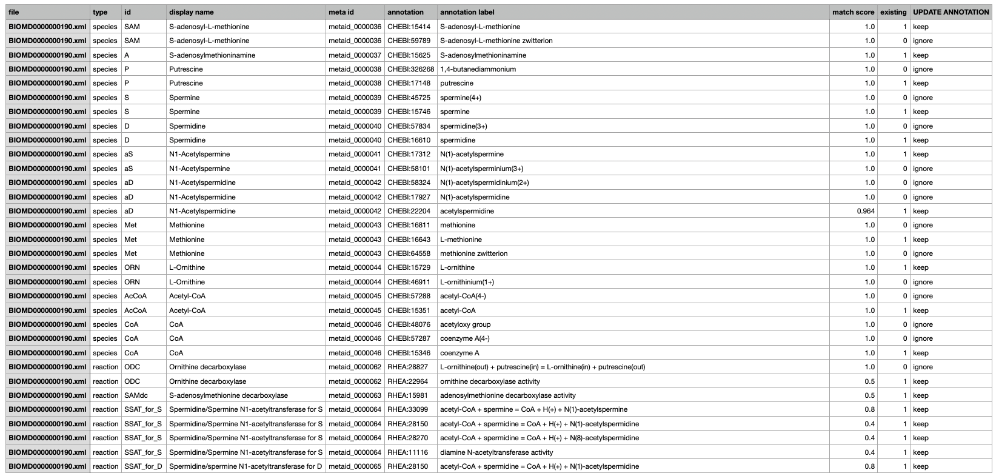

Basic Usage
===========

This section describes how ``AMAS`` can be used to get recommendations of annotations as a command-line tool. 

To install the package, use:

.. code-block:: console

   $ pip install AMAS-sb

Once installed, you can run the ``recommend_annotation`` command to get recommendations for all species and reactions existing in the model file. The example below assumes a model file ``BIOMD0000000190.xml`` exists in the current working directory: 

.. code-block:: console
 
   $ recommend_annotation BIOMD0000000190.xml 
   ...
   Analyzing 11 species...

   ...
   Analyzing 13 reaction(s)...

   Annotation recommended for 11 species:
   [A, AcCoA, CoA, D, Met, ORN, P, S, SAM, aD, aS]

   Annotation recommended for 13 reaction(s):
   [MAT, ODC, PAO_for_aD, PAO_for_aS, P_efflux, SAMdc, SSAT_for_D,
   SSAT_for_S, SpdS, SpmS, VCoA, VacCoA, aD_efflux]
  
   Recommendations saved as:
   /Users/amas/recommendations.csv

In the above example, only postional arguments were used; ``AMAS`` automatically detected all existing species and reactions, made recommendations for them, and saved it as ``recommendations.csv`` (default output file name) in the current working directory. Recommendations are made in ChEBI identifiers for species and in Rhea for reactions. For species, the algorithm uses display names (if not provided, IDs) to find the most similar items in ChEBI; for reactions, it uses each compoennt species (that is, reactants and products) and their predicted annotations. The saved recommnedations is displayed below (only a part of it is shown): 

