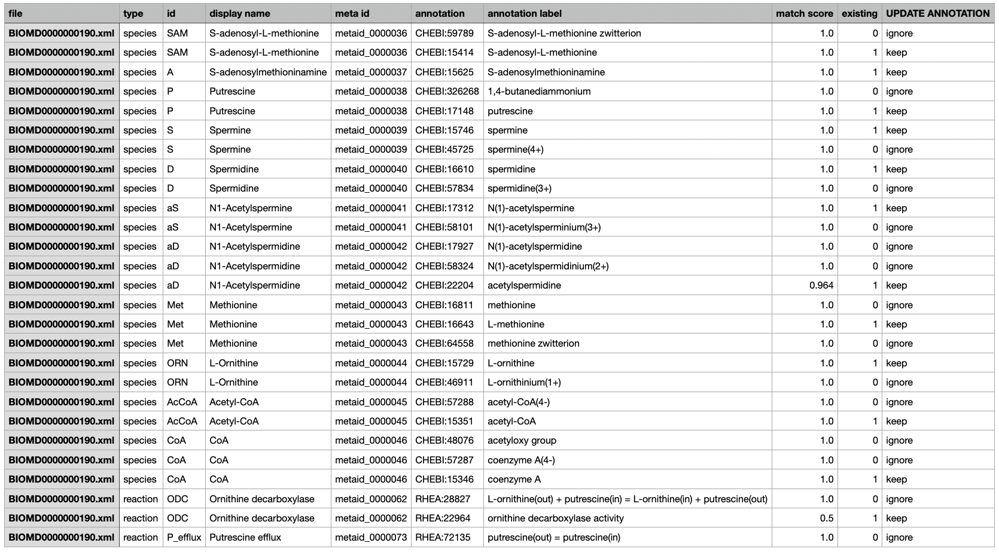

Getting Recommendations
=======================

This section describes how ``AMAS`` can be used to get recommendations of annotations. 

To install the package, use:

.. code-block:: console
   $ pip install AMAS-sb

Currently, ``AMAS`` can run either as a command-line tool or as a regular Python package. Most of the time, you will need to provide an exsiting SBML model file (XML) to run it. 

Once installed, you can run the ``recommend_annotation`` command to get recommendations for all species and reactions existing in the model file. The example below assumes a model file ``BIOMD0000000190.xml`` is in the current working directory and uses it. 

.. code-block:: console
 
   $ recommend_annotation BIOMD0000000190.xml --cutoff 0.9 --outfile res.csv
   ...
   Analyzing 11 species...

   ...
   Analyzing 13 reaction(s)...

   Annotation recommended for 11 species:
   [A, AcCoA, CoA, D, Met, ORN, P, S, SAM, aD, aS]

   Annotation recommended for 2 reaction(s):
   [ODC, P_efflux]
  
   Recommendations saved as:
   /Users/amas/rec.csv

In the above example, only recommendations for model elements with match score of 0.9 or above were provided and saved. The default value of the ``--cutoff`` option is 0.0, so if the option is not used, annotations of all model elements will be recommended. 

Recommendations will be made in ChEBI identifiers for species and in Rhea for reactions. For species, the algorithm uses display name (if not provided, ID) to find the most similar items in ChEBI; for reactions, it uses each compoennt species and their predicted annotations for each reaction. Recommendations are saved as a table, as shown below: 

