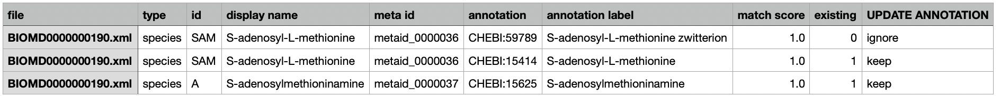
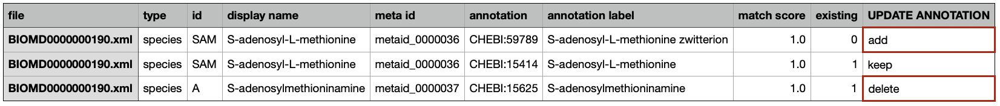

Updating Annotation
===================

This section explains updating annotations by providing feedback to the saved recommendations. Details of getting recommendation are demonstrated in :doc:`basics` and :doc:`recom`. 

First, let's get recommendations for two species: A and SAM. 

.. code-block:: console
 
   $ recommend_species BIOMD0000000190.xml --species A SAM --outfile species_rec.csv
   ...
   Analyzing 2 species...

   Annotation recommended for 2 species:
   [A, SAM]

   Recommendations saved as:
   /Users/amas/species_rec.csv

Once recommendations are saved, you will see a comma-separated value (CSV) file in the following format:

In the above, the `existing` column displays whether the annotation exists in the model file (1 means it exists, 0 otherwise). Now, you can choose to leave the value of the `UPDATE ANNOTATION` column (nothing will happen for that value); or, you can replace `ignore` with `add` and `keep` with `delete` to make changes. Below, user chose to add CHEBI:59789 to the existing annotation of SAM and delete existing annotation of A:

Once the table is updated, you can run the ``update_annotation`` command to update annotation of the SBML model, using ``BIOMD0000000190.xml`` (original model file) and ``species_rec.csv`` (recommendation file with user feedback):

.. code-block:: console
 
   $ update_annotation BIOMD0000000190.xml species_rec.csv new_model.xml
   ...
   Updated model file saved as:
   /Users/amas/new_model.xml

Then, you will see that the annotations have been updated in the new model file. 